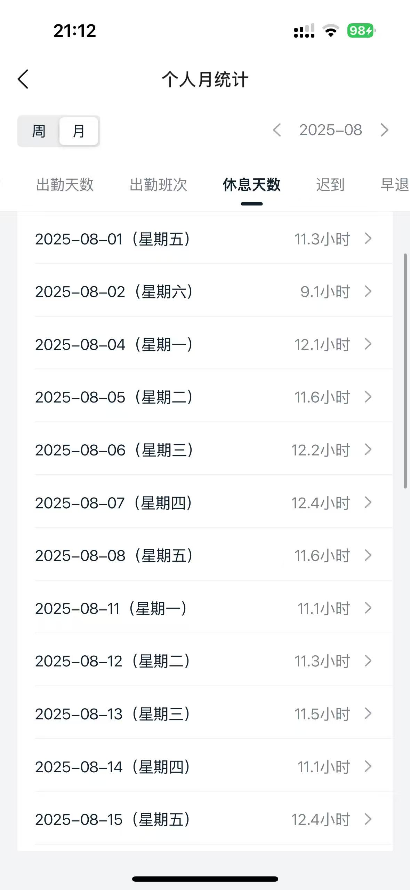

# 工时管理助手（Work Hour Assistant）

一个面向个人/团队的工时记录与统计小工具。支持大小周、请假、法定节假日与调休，自动统计"应上/实上/差值"，并提供未来展望与按天输入。前端使用 React + TypeScript + Vite，静态部署到 Vercel / GitHub Pages。

在线预览
- Vercel（推荐）：部署后自动生成 Production 链接
- GitHub Pages：`https://<your-username>.github.io/work-in-hour/`

核心功能
- 日历视图：显示整月（含上/下月占位），仅当月可点击
- 小周设置：周六可标记为小周（8h），未标记视为休息
- 请假：标记当天请假（实际 0h，仍计入应上时长）
- 工时录入：对每天直接输入实际工时
- 统计面板：已工作天数、总实上、总应上、差值、平均等
- 未来展望：基于剩余工作日与小周天数，预估"+/-Xh"
- 公共假期：使用 `holiday.cyi.me` 接口，含调休工作日（"补"徽标）
- **OCR 导入**：支持手机截图识别工时，智能预测大小周模式（14天周期）
- 本地持久化：localStorage 保存设置与数据

## OCR 功能特性
- 📸 **图像识别**：上传手机工时截图，自动识别日期和工时
- 🤖 **智能预测**：基于识别到的周六工时，自动预测14天大小周周期
- 🎯 **精准算法**：使用单锚定策略，确保预测结果准确（如识别16号→预测2/16/30号）
- 🔄 **自动覆盖**：可选择覆盖已有工时或仅填充空白日期
- 🚀 **本地处理**：使用 Tesseract.js 本地OCR，无需上传到服务器

### 使用示例
在弹出的 OCR 导入组件中点击“查看示例截图”可看到参考示例。你也可以将自己的示例图放入 `public/ocr-sample.jpg`，页面会自动展示：

```md

```

建议尽量保留“日期 (星期X)”与“X.X小时”的列表区域，裁掉无关头尾，能显著提升识别速度与准确率。

开发与运行
```bash
pnpm i # 或 npm i / yarn
npm run dev
```

构建与部署
```bash
# 生产构建
npm run build

# GitHub Pages（子路径 /work-in-hour/）
npm run build:pages
```

CI/CD
- Vercel：`.github/workflows/vercel.yml`（需要配置 VERCEL_TOKEN/ORG_ID/PROJECT_ID）
- GitHub Pages：`.github/workflows/pages.yml`（自动构建 `dist/` 并发布）

路径与资源
- Pages 使用子路径 `/work-in-hour/`，已在 CI 中通过 `vite build --base=/work-in-hour/` 固化，避免资源 404
- Vercel 使用根路径 `/`，无需特殊配置

性能优化
- 移除 `backdrop-filter`、减轻阴影与缩放、关闭 shimmer 动画，滚动更顺滑
- 点击日期弹出菜单使用 `requestAnimationFrame` 居中渲染，避免闪跳

接口与数据
- 节假日来源：`holiday.cyi.me`（24h 本地缓存 + 并发去重）
- 同步工具：`isHolidaySync/isWorkdayAdjustmentSync/getHolidayNameSync`

许可证
MIT
